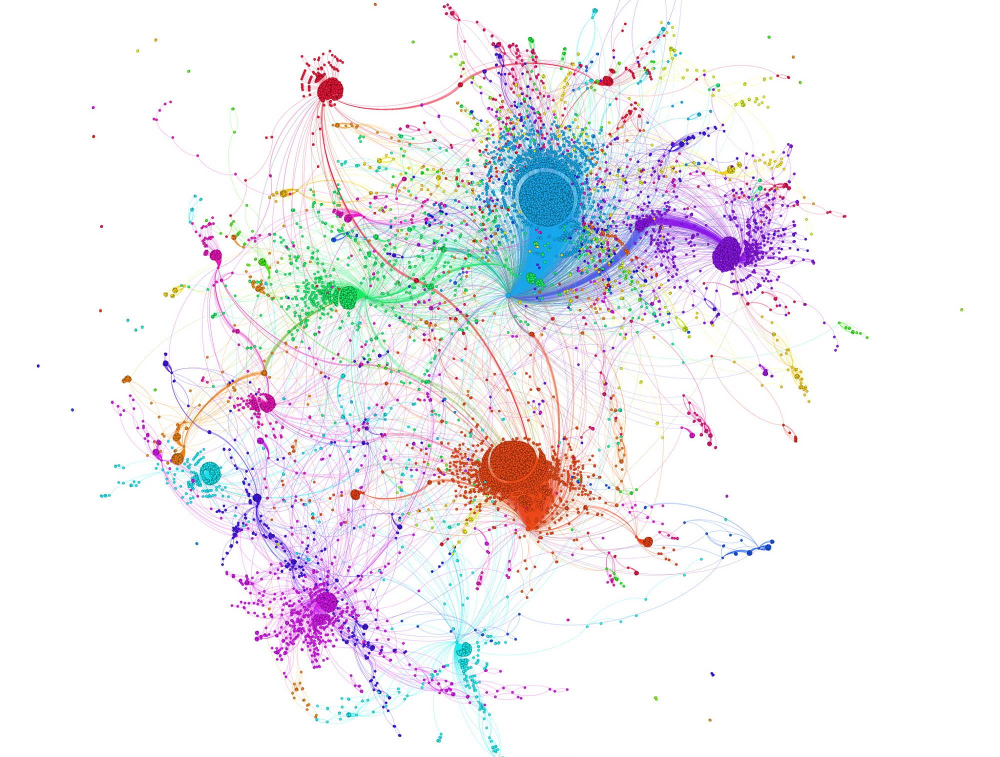
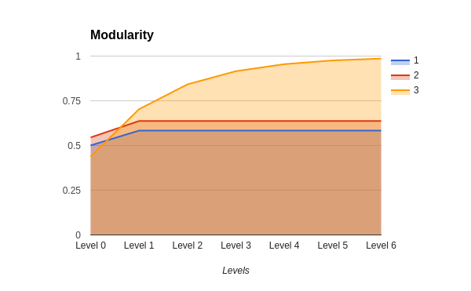
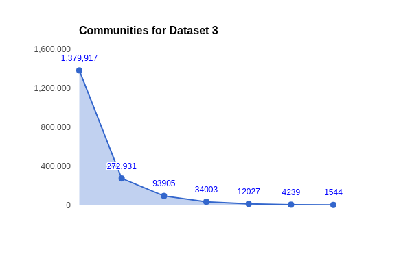

# GraphWise

Large Graph Processing - an academic project for DataBase Management Systems, 2017

The goal of this project was to load a large graph dataset from Stanford's SNAP large graph repository using a Graph Processing system [for which we used Hadoop and Spark both]. Simple queries to be run, along with profile performance.

**What we've done**: We have loaded 3 different datasets to analyse. Our goal was to detect different communities in these datasets, keeping in mind the modularity of the graph. The slides for this project can be viewed [here](https://docs.google.com/presentation/d/1vqUfn-RMMY38Iqnng9AassEGFZ97gGa4Ah4qTlB0lFg).

## Description

We'll first need to run Adapted Louvain algorithm for community detection for Map-Reduce framework. For this, we'll need to use the `louvain-modularity` folder. Refer to that folder's README for running the primal community detection algorithm. Once we have the formatted graph information, we'll need to evaluate how well our analysis worked.

*test_output*, *test_output_1*, *test_output_2* are the output folders for our 3 different datasets from the previous code base.

**tsne.py** - t-distributed stochastic neighbor embedding [tSNE] is a technique for dimensionality reduction used for visualising high dimensional data (in our case 27,000*27,000 dimensions). However, the computation takes a significant amount of time, so a visualisation was not possible for the largest dataset. **gen_matrix** and **gen_communities** are used to generate compatible files to visualise this data.

## Results

* Modularity achieved [Out of 1.00]

| Dataset | Level 0 | Level 1 | Level 2 | Level 3 | Level 4 | Level 5 | Level 6 |
| --- | --- | --- | --- | --- | --- | --- | --- |
| 1 | 0.5006 | 0.5833 | - | - | - | - | - |
| 2 | 0.5450 | 0.6370 | - | - | - | - | - |
| 3 | 0.4381 | 0.7031 | 0.8420 | 0.9156 | 0.9548 | 0.9757 | 0.9860 |

* Communities detected (Kept a track of number of nodes)

| Dataset | Original | Level 0 | Level 1 | Level 2 | Level 3 | Level 4 | Level 5 | Level 6 |
| --- | --- | --- | --- | --- | --- | --- | --- | --- |
| 1 | 27770 | 14543 | 1276 | 1276 | 1276 | 1276 | 1276 | 1276 |
| 2 | 34546 | 18793 | 1040 | 1040 | 1040 | 1040 | 1040 | 1040 |
| 3 | 1379917 | 817336 | 272931 | 93905 | 34003 | 12027 | 4239 | 1544 |

## Members
* Sourav Pal [@sourav-roni](https://github.com/sourav-roni)
* Sayan Mandal [@sayanmandal](https://github.com/sayanmandal)
* Projjal Chanda [@Projjal](https://github.com/projjal)
* Aditya Bhagwat [@Eraseread](https://github.com/Eraseread)
* Kaustubh Hiware [@kaustubhhiware](https://github.com/kaustubhhiware)

## Licensing

MIT. We have used some of the publicly available code, so we will not be restricting access to reuse our code. Although it would be awesome if you would mention our original project link in your work. Thanks.
